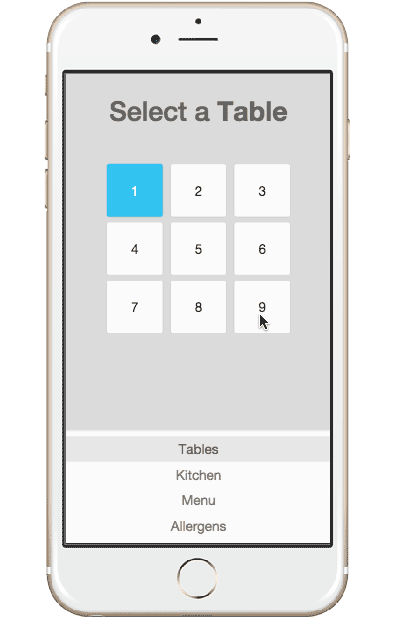

## RESTaurant Server Application

- User: Server
- Function: Create and manage food orders between parties and kitchen

### User Stories
- As a user, I want a very clean interface, so I can quickly and easily find the information I need
- As a user, I want to see my layout of tables and which are occupied, so that I can manage my tables accordingly
- As a user, I want to assign a party to an available table so I can use that as a reference point with the kitchen to coordinate orders
- As a user, I want to create item orders for each party and pass them on to the kitchen so the chefs can fill the orders
- As a user, I want the chefs to see which orders are most urgent, so that they can get me the orders in a timely fashion
- As a user, I want to be able to add and delete items from a party's order so the order is customized to the party's wishes
- As a user, I want to be able to create and print a receipt compiled with the party's orders, their prices, the subtotal as well as tip suggestions, so that the party can see what they owe and pay accordingly
- As a user, I want to be able to confirm when a party has paid their bill, so I can effectively clear the table for the next party

### Technologies
- Ruby / Sinatra / PSQL
- javascript / jQuery
- CSS3 / Bootstrap
- HTML5
